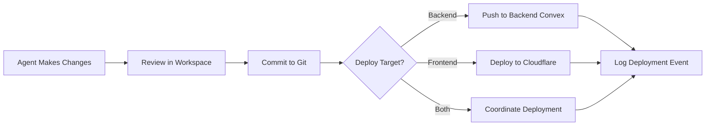

# ONE Desktop: Multi-Agent Command Center

**Status:** Planning
**Based On:** [emdash](https://github.com/generalaction/emdash) - Multi-agent parallel execution UI
**Purpose:** Desktop application for managing multiple AI coding agents working on ONE platform projects

---

## Vision

ONE Desktop transforms emdash's multi-agent orchestration into a native command center for the ONE platform, where developers coordinate autonomous AI agents that build, deploy, and maintain AI-powered businesses through ONE's 6-dimension ontology (organizations, people, things, connections, events, knowledge).

**Core Philosophy:** Just as emdash enables parallel agent execution across git worktrees, ONE Desktop enables parallel agent execution across your entire business ontology — from content creation to audience engagement to knowledge generation.

---

## Architecture Alignment with ONE Ontology

### Things (Entities)

```typescript
// Desktop-specific thing types (extend ontology)
type DesktopThingType =
  | "desktop_session" // Running desktop instance
  | "agent_workspace" // Isolated agent environment
  | "git_worktree" // Git worktree instance
  | "agent_task" // Task assigned to agent
  | "agent_output" // Agent-generated artifact
  | "workspace_snapshot" // Saved workspace state
  | "agent_conversation"; // Chat history with agent
```

### Connections (Relationships)

```typescript
// Desktop workspace relationships
relationshipType =
  | 'manages_workspace'      // User → agent_workspace
  | 'executes_in'           // agent → git_worktree
  | 'produced_by'           // agent_output → agent
  | 'assigned_to'           // agent_task → agent
  | 'synchronized_with'     // workspace → backend deployment
```

### Events (Actions)

```typescript
// Desktop activity tracking
eventType =
  | 'workspace_created'
  | 'agent_started'
  | 'agent_completed_task'
  | 'agent_failed'
  | 'workspace_synchronized'
  | 'output_reviewed'
  | 'changes_committed'
  | 'changes_deployed'
```

### Knowledge (RAG + Labels)

- Index all agent outputs as knowledge chunks
- Label tasks by `capability:*`, `technology:*`, `status:*`
- Enable semantic search across all agent conversations
- Feed context to agents from your entire ONE deployment

---

## Technology Stack (from emdash)

### Core Technologies

- **Electron** - Cross-platform desktop (macOS, Windows, Linux)
- **TypeScript** - Type-safe throughout
- **Vite** - Fast build tooling
- **Tailwind CSS** - Consistent with ONE web UI
- **SQLite** - Local-first data persistence

### Key Differences from emdash

1. **Backend Integration** - Sync with ONE backend (Convex)
2. **Ontology-Aware** - All operations map to things/connections/events
3. **Knowledge Engine** - Built-in RAG for agent context
4. **Multi-Deployment** - Manage multiple ONE deployments
5. **Edge-Aware** - Deploy directly to Cloudflare from desktop

---

## Feature Set

### 1. Agent Orchestration (from emdash)

**Inherited Features:**

- ✅ Run multiple AI agents in parallel
- ✅ Isolated git worktrees per agent
- ✅ Support for Claude Code, Cursor, GitHub Copilot, etc.
- ✅ Local SQLite for workspace tracking

**ONE Enhancements:**

- 🆕 Map agents to `business_agents` ontology (strategy, marketing, sales, etc.)
- 🆕 Agents share knowledge through ONE's knowledge table
- 🆕 Tasks create `agent_task` things with proper connections
- 🆕 All agent activity logged as events for analytics

### 2. Workspace Management

**Base (emdash):**

```typescript
interface Workspace {
  id: string;
  name: string;
  path: string;
  worktrees: Worktree[];
  agents: Agent[];
}
```

**ONE Extension:**

```typescript
interface ONEWorkspace extends Workspace {
  // Link to ONE deployment
  deployment: {
    url: string; // Backend Convex URL
    organizationId: Id<"things">; // Org this workspace belongs to
    creatorId: Id<"things">; // Creator who owns it
  };

  // Sync state with backend
  syncStatus: {
    lastSynced: number;
    pendingChanges: number;
    conflictingFiles: string[];
  };

  // Knowledge integration
  knowledgeIndex: {
    totalChunks: number;
    lastIndexed: number;
    embeddingModel: string;
  };
}
```

### 3. Agent Capabilities Matrix

| Agent Type               | emdash Support | ONE Integration                  |
| ------------------------ | -------------- | -------------------------------- |
| Claude Code              | ✅ Built-in    | Map to `engineering_agent`       |
| Cursor                   | ✅ Built-in    | Map to `engineering_agent`       |
| GitHub Copilot           | ✅ Built-in    | Map to `engineering_agent`       |
| Custom Agents            | ✅ Extensible  | Map to 10 `business_agents`      |
| External (ElizaOS, etc.) | ❌ None        | 🆕 Via `external_agent` ontology |

### 4. Deployment Pipeline

**emdash:** Git operations only
**ONE Desktop:** Full deployment flow



---

## User Experience Flow

### 1. Launch & Connect

```
┌─────────────────────────────────────┐
│  ONE Desktop                        │
│                                     │
│  [+] Connect to ONE Backend         │
│      Enter Convex URL or select:   │
│      • Local (localhost:3000)      │
│      • Production (one.ie)          │
│      • Custom deployment            │
│                                     │
│  [↓] Sync Organizations             │
│      ✓ My Organization              │
│      ✓ Client Projects              │
└─────────────────────────────────────┘
```

### 2. Create Workspace

```
┌─────────────────────────────────────┐
│  New Workspace                      │
│                                     │
│  Name: ________________             │
│  Path: [Browse...]                  │
│                                     │
│  Template:                          │
│  ○ Full Stack (Frontend + Backend) │
│  ○ Frontend Only                    │
│  ○ Backend Only                     │
│  ○ Existing Repository              │
│                                     │
│  Organization: [Dropdown]           │
│                                     │
│  [Create Workspace]                 │
└─────────────────────────────────────┘
```

### 3. Agent Dashboard (Main View)

```
┌──────────────────────────────────────────────────────────────┐
│ ONE Desktop - My SaaS Project                   [Sync] [•••] │
├──────────────────────────────────────────────────────────────┤
│ ACTIVE AGENTS                                    Add Agent [+]│
├──────────────────────────────────────────────────────────────┤
│ ┌──────────────┐  ┌──────────────┐  ┌──────────────┐        │
│ │ Claude Code  │  │ Cursor       │  │ Marketing    │        │
│ │ engineering  │  │ engineering  │  │ Agent        │        │
│ ├──────────────┤  ├──────────────┤  ├──────────────┤        │
│ │ Working on:  │  │ Working on:  │  │ Working on:  │        │
│ │ Auth system  │  │ UI polish    │  │ Blog content │        │
│ │              │  │              │  │              │        │
│ │ Status: 🟢   │  │ Status: 🟢   │  │ Status: ⏸    │        │
│ │ 23 changes   │  │ 8 changes    │  │ 3 drafts     │        │
│ └──────────────┘  └──────────────┘  └──────────────┘        │
├──────────────────────────────────────────────────────────────┤
│ KNOWLEDGE BASE                              Search [........] │
├──────────────────────────────────────────────────────────────┤
│ • 1,247 chunks indexed                                       │
│ • Last sync: 2 minutes ago                                   │
│ • Model: text-embedding-3-large                              │
│ • Context available to all agents                            │
├──────────────────────────────────────────────────────────────┤
│ RECENT ACTIVITY                                  View All → │
├──────────────────────────────────────────────────────────────┤
│ 2m ago  Claude Code completed "Add email verification"       │
│ 5m ago  Cursor committed "Polish dashboard UI"               │
│ 12m ago Marketing Agent generated 3 blog posts               │
│ 15m ago Workspace synced with backend                        │
└──────────────────────────────────────────────────────────────┘
```

### 4. Agent Detail View (Click on an agent)

```
┌──────────────────────────────────────────────────────────────┐
│ ← Back to Dashboard                Claude Code - Engineering │
├──────────────────────────────────────────────────────────────┤
│ CURRENT TASK                                                 │
│ Implement email verification system                          │
│ Assigned: 45 minutes ago                                     │
│ Worktree: /path/to/project/.worktrees/claude-email-verify  │
├──────────────────────────────────────────────────────────────┤
│ CONVERSATION                                    [Send Task] │
│ ┌──────────────────────────────────────────────────────────┐ │
│ │ You: Add email verification with Better Auth            │ │
│ │                                                          │ │
│ │ Claude: I'll implement email verification. Here's my    │ │
│ │ plan:                                                    │ │
│ │ 1. Add verification token entity type                   │ │
│ │ 2. Create verification mutation                         │ │
│ │ 3. Add email template                                   │ │
│ │ 4. Update UI for verify flow                            │ │
│ │                                                          │ │
│ │ [Show Generated Code]                                    │ │
│ └──────────────────────────────────────────────────────────┘ │
│ [Type a message...]                              [Send]     │
├──────────────────────────────────────────────────────────────┤
│ CHANGES (23)                                    [Review All] │
│ ✓ backend/convex/auth/verify.ts            +127 -0          │
│ ✓ backend/convex/schema.ts                 +15 -2           │
│ ✓ frontend/src/pages/verify.astro          +89 -0           │
│ ✓ frontend/src/components/VerifyEmail.tsx  +156 -0          │
│ ... 19 more files                                            │
│                                                              │
│ [Commit Changes] [Deploy to Backend] [Deploy to Frontend]   │
└──────────────────────────────────────────────────────────────┘
```

---

## Data Model (SQLite Schema)

### Base Schema (from emdash)

```sql
-- Workspaces
CREATE TABLE workspaces (
  id TEXT PRIMARY KEY,
  name TEXT NOT NULL,
  path TEXT NOT NULL,
  created_at INTEGER NOT NULL,
  updated_at INTEGER NOT NULL
);

-- Agents
CREATE TABLE agents (
  id TEXT PRIMARY KEY,
  workspace_id TEXT NOT NULL,
  provider TEXT NOT NULL,  -- 'claude', 'cursor', 'copilot'
  status TEXT NOT NULL,    -- 'idle', 'running', 'paused', 'error'
  created_at INTEGER NOT NULL,
  FOREIGN KEY (workspace_id) REFERENCES workspaces(id)
);

-- Worktrees
CREATE TABLE worktrees (
  id TEXT PRIMARY KEY,
  workspace_id TEXT NOT NULL,
  agent_id TEXT,
  path TEXT NOT NULL,
  branch TEXT NOT NULL,
  created_at INTEGER NOT NULL,
  FOREIGN KEY (workspace_id) REFERENCES workspaces(id),
  FOREIGN KEY (agent_id) REFERENCES agents(id)
);
```

### ONE Extensions

```sql
-- ONE Backend Connection
CREATE TABLE deployments (
  id TEXT PRIMARY KEY,
  name TEXT NOT NULL,
  convex_url TEXT NOT NULL,
  organization_id TEXT,  -- Links to ONE backend
  creator_id TEXT,       -- Links to ONE backend
  access_token TEXT,     -- Encrypted
  last_synced INTEGER,
  created_at INTEGER NOT NULL
);

-- Link workspaces to deployments
ALTER TABLE workspaces ADD COLUMN deployment_id TEXT
  REFERENCES deployments(id);

-- Knowledge Index
CREATE TABLE knowledge_chunks (
  id TEXT PRIMARY KEY,
  workspace_id TEXT NOT NULL,
  source_file TEXT NOT NULL,
  chunk_index INTEGER NOT NULL,
  text TEXT NOT NULL,
  embedding BLOB,  -- Stored as binary
  embedding_model TEXT,
  created_at INTEGER NOT NULL,
  FOREIGN KEY (workspace_id) REFERENCES workspaces(id)
);

-- Agent Tasks (map to ONE's agent_task things)
CREATE TABLE tasks (
  id TEXT PRIMARY KEY,
  agent_id TEXT NOT NULL,
  thing_id TEXT,  -- ONE backend thing ID
  title TEXT NOT NULL,
  description TEXT,
  status TEXT NOT NULL,  -- 'pending', 'in_progress', 'completed', 'failed'
  started_at INTEGER,
  completed_at INTEGER,
  created_at INTEGER NOT NULL,
  FOREIGN KEY (agent_id) REFERENCES agents(id)
);

-- Sync Queue (changes pending sync to backend)
CREATE TABLE sync_queue (
  id TEXT PRIMARY KEY,
  workspace_id TEXT NOT NULL,
  entity_type TEXT NOT NULL,  -- 'thing', 'connection', 'event', 'knowledge'
  entity_id TEXT NOT NULL,
  operation TEXT NOT NULL,    -- 'create', 'update', 'delete'
  payload TEXT NOT NULL,      -- JSON
  synced BOOLEAN DEFAULT 0,
  created_at INTEGER NOT NULL,
  FOREIGN KEY (workspace_id) REFERENCES workspaces(id)
);
```

---

## Sync Strategy: Desktop ↔️ Backend

### 1. Initial Connection

```typescript
async function connectToBackend(convexUrl: string): Promise<Deployment> {
  // 1. Authenticate with Better Auth
  const authClient = new BetterAuthClient({ baseURL: convexUrl });
  const session = await authClient.signIn({
    /* ... */
  });

  // 2. Fetch user's organizations
  const orgs = await convex.query(api.queries.orgs.listMyOrgs);

  // 3. Create deployment record
  const deployment = await db.deployments.insert({
    convex_url: convexUrl,
    organization_id: orgs[0]._id,
    creator_id: session.user._id,
    access_token: encrypt(session.token),
  });

  return deployment;
}
```

### 2. Continuous Sync

```typescript
// Watch for local changes
const watcher = chokidar.watch(workspace.path, {
  ignored: /(^|[\/\\])\../, // ignore dotfiles
  persistent: true,
});

watcher.on("change", async (path) => {
  // 1. Determine entity type from file path
  const entityType = inferEntityType(path);

  // 2. Extract data from file
  const data = await parseFile(path);

  // 3. Queue for sync
  await db.sync_queue.insert({
    workspace_id: workspace.id,
    entity_type: entityType,
    entity_id: data.id || generateId(),
    operation: "update",
    payload: JSON.stringify(data),
  });
});

// Sync queue processor (runs every 5 seconds)
setInterval(async () => {
  const pending = await db.sync_queue.findMany({
    where: { synced: false },
    limit: 100,
  });

  for (const item of pending) {
    try {
      // Send to backend
      await convex.mutation(api.mutations.sync.upsert, {
        entityType: item.entity_type,
        entityId: item.entity_id,
        data: JSON.parse(item.payload),
      });

      // Mark synced
      await db.sync_queue.update(item.id, { synced: true });
    } catch (error) {
      console.error("Sync failed:", error);
      // Retry with exponential backoff
    }
  }
}, 5000);
```

### 3. Conflict Resolution

```typescript
interface SyncConflict {
  file: string;
  localVersion: string;
  remoteVersion: string;
  localModified: number;
  remoteModified: number;
}

async function resolveConflicts(conflicts: SyncConflict[]): Promise<void> {
  // Show UI dialog
  const resolution = await showConflictDialog(conflicts);

  for (const conflict of conflicts) {
    switch (resolution[conflict.file]) {
      case "keep-local":
        // Overwrite remote with local
        await syncToBackend(conflict.localVersion);
        break;
      case "keep-remote":
        // Overwrite local with remote
        await syncFromBackend(conflict.remoteVersion);
        break;
      case "merge":
        // Manual merge in editor
        await openMergeTool(conflict);
        break;
    }
  }
}
```

---

## Agent Integration Patterns

### 1. Engineering Agents (Claude, Cursor, Copilot)

**Workflow:**

```
User assigns task → Agent works in isolated worktree →
Agent makes changes → Desktop detects changes →
Queue for review → User approves → Commit & sync →
Deploy to backend/frontend → Log events
```

**Example Task:**

```typescript
const task = await createTask({
  agent: "claude-code",
  title: "Add user profile page",
  context: [
    "User should see their name, email, avatar",
    "Add edit functionality",
    "Use existing auth session",
    'Follow ontology: user is a "creator" thing',
  ],
  knowledge: await searchKnowledge("user profile ontology"),
});

// Claude works on it...

// When done, review changes
const changes = await getAgentChanges(task.agent_id);
// ... 45 files changed, 2,847 insertions, 156 deletions

// Approve & deploy
await commitChanges(task.agent_id, "feat: add user profile page");
await deployToBackend(changes.backend);
await deployToFrontend(changes.frontend);
```

### 2. Business Agents (Strategy, Marketing, Sales, etc.)

**Workflow:**

```
User assigns business task → Agent queries knowledge →
Agent generates output (content, strategy, etc.) →
Desktop saves as thing in backend → Logs event →
Other agents can use output as context
```

**Example Task:**

```typescript
const task = await createTask({
  agent: "marketing-agent",
  title: "Generate blog post about ONE Desktop launch",
  context: [
    "Target audience: developers and creators",
    "Highlight multi-agent orchestration",
    "Include technical details from ontology",
    "SEO optimized",
  ],
  knowledge: await searchKnowledge("ONE desktop agent orchestration"),
});

// Marketing agent generates 3 blog posts...

// Save as things in backend
for (const post of task.outputs) {
  await convex.mutation(api.mutations.content.create, {
    type: "blog_post",
    name: post.title,
    properties: {
      content: post.content,
      seo: post.seo,
      generatedBy: "marketing_agent",
    },
    status: "draft",
  });
}
```

### 3. External Agents (ElizaOS, AutoGen, etc.)

**Workflow:**

```
Connect external agent via API → Register as external_agent thing →
Desktop routes tasks via A2A protocol → External agent works →
Results sync back to desktop → Log events → Update knowledge
```

**Example Integration:**

```typescript
// Register external agent
const elizaAgent = await convex.mutation(api.mutations.agents.createExternal, {
  type: "external_agent",
  name: "ElizaOS Research Agent",
  properties: {
    platform: "elizaos",
    apiEndpoint: "https://api.eliza.ai/v1",
    capabilities: ["research", "summarization", "data-extraction"],
  },
});

// Assign task via A2A protocol
const task = await createTask({
  agent: elizaAgent._id,
  title: "Research competitor pricing",
  context: ["Find top 10 competitors", "Extract pricing tiers"],
  protocol: "a2a",
});

// ElizaOS works on it...

// Results come back via webhook
app.post("/webhook/eliza", async (req, res) => {
  const result = req.body;

  // Save to knowledge
  await convex.mutation(api.mutations.knowledge.create, {
    knowledgeType: "document",
    text: result.summary,
    sourceThingId: elizaAgent._id,
    labels: ["research", "competitor-analysis"],
  });

  // Log event
  await convex.mutation(api.mutations.events.log, {
    type: "agent_completed",
    actorId: elizaAgent._id,
    targetId: task._id,
    metadata: { protocol: "a2a", duration: result.duration },
  });
});
```

---

## Knowledge Integration

### 1. Automatic Indexing

```typescript
// Watch workspace for changes
const indexer = new WorkspaceIndexer(workspace);

indexer.on("file-changed", async (file) => {
  // Extract text
  const text = await readFile(file.path);

  // Chunk it (800 tokens, 200 overlap)
  const chunks = chunkText(text, { size: 800, overlap: 200 });

  // Generate embeddings
  for (const chunk of chunks) {
    const embedding = await openai.embeddings.create({
      model: "text-embedding-3-large",
      input: chunk.text,
    });

    // Store locally
    await db.knowledge_chunks.insert({
      workspace_id: workspace.id,
      source_file: file.path,
      chunk_index: chunk.index,
      text: chunk.text,
      embedding: Buffer.from(
        new Float32Array(embedding.data[0].embedding).buffer
      ),
      embedding_model: "text-embedding-3-large",
    });

    // Queue for backend sync
    await queueKnowledgeSync(workspace.id, chunk);
  }
});
```

### 2. Context Retrieval for Agents

```typescript
async function getAgentContext(agent: Agent, query: string): Promise<string[]> {
  // 1. Generate query embedding
  const queryEmbedding = await openai.embeddings.create({
    model: "text-embedding-3-large",
    input: query,
  });

  // 2. Search local knowledge (SQLite vector search or brute force)
  const localChunks = await searchLocalKnowledge(
    workspace.id,
    queryEmbedding.data[0].embedding,
    { limit: 5 }
  );

  // 3. Search backend knowledge (Convex vector search)
  const backendChunks = await convex.query(api.queries.knowledge.search, {
    query: queryEmbedding.data[0].embedding,
    organizationId: workspace.deployment.organizationId,
    limit: 5,
  });

  // 4. Combine and deduplicate
  const allChunks = [...localChunks, ...backendChunks];
  const uniqueChunks = deduplicateByContent(allChunks);

  // 5. Return as context strings
  return uniqueChunks.map((chunk) => chunk.text);
}

// Use in agent prompt
const context = await getAgentContext(agent, task.description);
const systemPrompt = `
You are ${agent.type} working on ${task.title}.

Relevant context from the knowledge base:
${context.join("\n\n---\n\n")}

Task: ${task.description}

Follow the ONE ontology when making changes. All entities should map to the 6-dimension architecture (organizations, people, things, connections, events, knowledge).
`;
```

---

## Deployment Integration

### 1. Backend Deployment (Convex)

```typescript
async function deployBackend(workspace: Workspace): Promise<void> {
  const backendPath = path.join(workspace.path, "backend");

  // 1. Run type check
  await exec("npm run typecheck", { cwd: backendPath });

  // 2. Deploy to Convex
  const result = await exec("npx convex deploy", {
    cwd: backendPath,
    env: {
      CONVEX_DEPLOYMENT: workspace.deployment.convex_url,
    },
  });

  // 3. Log deployment event
  await convex.mutation(api.mutations.events.log, {
    type: "deployment_completed",
    actorId: workspace.creatorId,
    metadata: {
      target: "backend",
      deployment_url: workspace.deployment.convex_url,
      duration: result.duration,
    },
  });

  // 4. Update workspace sync status
  await db.workspaces.update(workspace.id, {
    last_synced: Date.now(),
  });
}
```

### 2. Frontend Deployment (Cloudflare)

```typescript
async function deployFrontend(workspace: Workspace): Promise<void> {
  const frontendPath = path.join(workspace.path, "frontend");

  // 1. Build
  await exec("npm run build", { cwd: frontendPath });

  // 2. Deploy to Cloudflare Pages
  const result = await exec("npx wrangler pages deploy ./dist", {
    cwd: frontendPath,
    env: {
      CLOUDFLARE_API_TOKEN: await getCloudflareToken(),
    },
  });

  // 3. Extract deployment URL
  const deployUrl = extractDeployUrl(result.stdout);

  // 4. Log deployment event
  await convex.mutation(api.mutations.events.log, {
    type: "deployment_completed",
    actorId: workspace.creatorId,
    metadata: {
      target: "frontend",
      deployment_url: deployUrl,
      duration: result.duration,
    },
  });
}
```

### 3. Coordinated Deployment (Full Stack)

```typescript
async function deployFullStack(workspace: Workspace): Promise<void> {
  // Deploy in parallel when possible
  const [backendResult, frontendResult] = await Promise.all([
    deployBackend(workspace),
    deployFrontend(workspace),
  ]);

  // Update website thing in backend
  await convex.mutation(api.mutations.things.update, {
    id: workspace.websiteThingId,
    properties: {
      domain: frontendResult.url,
      lastDeployed: Date.now(),
    },
  });

  // Show success notification
  showNotification({
    title: "Deployment Complete",
    message: `Backend and frontend deployed successfully!`,
    url: frontendResult.url,
  });
}
```

---

## Security & Privacy

### 1. Local-First Data

- All workspace data stored locally in SQLite
- Embeddings computed locally (option to use local models)
- Credentials encrypted with OS keychain (Keytar)
- No data sent to ONE backend without explicit sync

### 2. Credential Management

```typescript
import keytar from "keytar";

// Store Convex access token securely
async function storeCredentials(
  deployment: Deployment,
  token: string
): Promise<void> {
  await keytar.setPassword("one-desktop", deployment.convex_url, token);
}

// Retrieve token for sync
async function getCredentials(deployment: Deployment): Promise<string> {
  const token = await keytar.getPassword("one-desktop", deployment.convex_url);

  if (!token) {
    throw new Error("Not authenticated. Please sign in.");
  }

  return token;
}
```

### 3. Permission Scopes

```typescript
// Request minimal permissions from backend
const scopes = [
  "read:things", // Read entities
  "write:things", // Create/update entities
  "read:events", // Read activity logs
  "write:events", // Log new events
  "read:knowledge", // Search knowledge base
  "write:knowledge", // Add knowledge chunks
  "deploy:backend", // Deploy Convex functions
  "deploy:frontend", // Deploy to Cloudflare
];

// User approves during first connection
const session = await authClient.signIn({
  scopes,
  approval: "interactive", // Shows permission dialog
});
```

---

## Platform Support

### macOS

- **Native Features:**
  - Menu bar integration
  - Touch Bar support for agent controls
  - Spotlight search for tasks
  - Notification Center for agent updates

### Windows

- **Native Features:**
  - System tray integration
  - Windows Search integration
  - Toast notifications
  - Jump lists for recent workspaces

### Linux

- **Native Features:**
  - System tray (via libappindicator)
  - Desktop notifications
  - KDE/GNOME integration

---

## Development Roadmap

### Phase 1: MVP (Q1 2025)

- ✅ Fork emdash codebase
- ✅ Add ONE branding and UI
- ✅ Implement basic Convex sync
- ✅ Support Claude Code and Cursor
- ✅ Basic knowledge indexing (local only)

### Phase 2: Full Integration (Q2 2025)

- ⬜ Complete ontology mapping
- ⬜ Real-time sync with backend
- ⬜ All 10 business agents supported
- ⬜ External agent integration (ElizaOS, AutoGen)
- ⬜ Vector search across local + backend knowledge

### Phase 3: Advanced Features (Q3 2025)

- ⬜ Multi-deployment management
- ⬜ Conflict resolution UI
- ⬜ Agent marketplace (discover & install agents)
- ⬜ Workflow templates
- ⬜ Team collaboration (shared workspaces)

### Phase 4: Enterprise (Q4 2025)

- ⬜ SSO integration
- ⬜ Audit logging
- ⬜ Role-based access control
- ⬜ Air-gapped mode (fully offline)
- ⬜ Custom agent development SDK

---

## Success Metrics

### Developer Experience

- **Goal:** Ship 10x faster with AI agents
- **Metrics:**
  - Average task completion time
  - Number of agents used per project
  - Lines of code generated vs manually written

### System Performance

- **Goal:** Sub-second responsiveness
- **Metrics:**
  - Agent startup time < 2s
  - Sync latency < 500ms
  - Search response time < 100ms

### Adoption

- **Goal:** 10,000 active developers by end of 2025
- **Metrics:**
  - Monthly active users
  - Workspaces created
  - Deployments triggered
  - Knowledge chunks indexed

---

## Technical Comparison: emdash vs ONE Desktop

| Feature                  | emdash                         | ONE Desktop                       |
| ------------------------ | ------------------------------ | --------------------------------- |
| **Core Purpose**         | Multi-agent parallel execution | AI business orchestration         |
| **Data Model**           | SQLite (custom schema)         | SQLite + ONE ontology sync        |
| **Supported Agents**     | 7 coding agents                | 7 coding + 10 business + external |
| **Backend Integration**  | None                           | Full Convex sync                  |
| **Knowledge Base**       | None                           | Built-in RAG with embeddings      |
| **Deployment**           | Git only                       | Git + Convex + Cloudflare         |
| **Organization Support** | Single user                    | Multi-tenant orgs                 |
| **Conflict Resolution**  | Manual                         | UI-guided + auto-merge            |
| **Analytics**            | None                           | Full event tracking               |
| **Marketplace**          | None                           | Agent & template marketplace      |

---

## Why ONE Desktop > emdash

1. **Ontology Integration** - Every operation maps to ONE's 4-table system
2. **Knowledge Engine** - Agents share context through unified RAG
3. **Business Agents** - Beyond code: strategy, marketing, sales, etc.
4. **Full Deployment** - From development to production in one click
5. **Multi-Tenant** - Manage multiple orgs and projects
6. **Protocol-Aware** - Support A2A, ACP, AP2, X402 out of the box
7. **Edge-Native** - Deploy to Cloudflare's global network
8. **Event-Driven** - Complete audit trail and analytics
9. **Extensible** - Plugin system for custom agents and workflows
10. **Open Source** - Fork, customize, and contribute back

---

## Getting Started (Developer)

### Prerequisites

- Node.js 20+
- Git
- Convex account (free tier)
- Cloudflare account (free tier)

### Installation

```bash
# Clone the repo
git clone https://github.com/one-ie/desktop
cd desktop

# Install dependencies
npm install

# Start in dev mode
npm run dev

# Build for production
npm run build

# Package for distribution
npm run package
```

### Configuration

```typescript
// ~/.one-desktop/config.json
{
  "deployments": [
    {
      "name": "Production",
      "url": "https://your-backend.convex.cloud",
      "default": true
    },
    {
      "name": "Development",
      "url": "http://localhost:3000",
      "default": false
    }
  ],
  "agents": {
    "claude": {
      "enabled": true,
      "apiKey": "sk-ant-..."  // Or use system env var
    },
    "cursor": {
      "enabled": true
    }
  },
  "knowledge": {
    "indexingEnabled": true,
    "embeddingModel": "text-embedding-3-large",
    "maxChunkSize": 800,
    "chunkOverlap": 200
  },
  "sync": {
    "autoSync": true,
    "syncInterval": 5000,
    "conflictResolution": "prompt"  // or "keep-local", "keep-remote"
  }
}
```

---

## Conclusion

**ONE Desktop transforms emdash from a multi-agent code orchestrator into a complete AI business command center.**

By integrating with ONE's ontology, knowledge engine, and deployment pipeline, developers can:

- Orchestrate 17+ AI agents (7 coding + 10 business)
- Build applications that map to a clean 4-table data model
- Deploy instantly to global edge infrastructure
- Generate and sell knowledge to other AI agents
- Manage entire AI-powered businesses from one desktop app

**The future of development is AI-native. ONE Desktop makes it real.**

---

## References

- **emdash GitHub:** https://github.com/generalaction/emdash
- **ONE Ontology:** `/one/knowledge/ontology.md`
- **ONE Vision:** `/one/things/vision.md`
- **ONE Platform:** https://one.ie

---

**Status:** Ready for development
**Next Steps:**

1. Fork emdash repository
2. Set up ONE branding
3. Implement Convex sync layer
4. Build ontology mapping
5. Launch private beta
